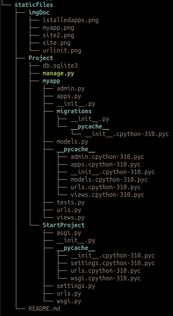

# static Files

## Etapa 1: Criação do projeto

```bash
django-admin startproject StartProject
```
O django criara um projeto chamado StartProject dentro do dir Project . Com a seguinte estrutura:

```
Project
    ├── manage.py
    ├── StartProject
        ├── settings.py
        ├── __init__.py
        ├── wsgi.py
        ├── asgi.py
        ├── urls.py
```


No Django, a estrutura básica de um projeto gerado por startproject geralmente inclui vários arquivos importantes. Aqui está uma breve descrição de cada arquivo na estrutura que você forneceu:


### settings.py

Este arquivo contém as configurações do seu projeto Django. Aqui você define variáveis como configurações de banco de dados, configurações de aplicativos, chaves secretas, etc. É um arquivo crucial para a configuração do seu projeto.
### init.py

Este é um arquivo vazio que informa ao Python que o diretório contendo este arquivo deve ser considerado um pacote Python. É necessário para que o Python reconheça o diretório como parte do seu pacote.
### wsgi.py

O nome WSGI significa "Web Server Gateway Interface". Este arquivo é usado para expor seu aplicativo Django ao servidor web. É responsável por configurar a interface entre o seu aplicativo e o servidor web.
### asgi.py

O nome ASGI significa "Asynchronous Server Gateway Interface". Este arquivo é semelhante ao wsgi.py, mas é usado quando você deseja suportar conexões assíncronas, úteis para aplicativos em tempo real ou que exigem um tratamento eficiente de muitas conexões simultâneas.
### urls.py

Neste arquivo, você define as rotas URL para o seu projeto Django. Ele mapeia URLs para visualizações específicas, direcionando as solicitações do usuário para o código Python correspondente.
### manage.py

Este é um script de linha de comando que facilita a execução de várias tarefas relacionadas ao seu projeto. Você pode usá-lo para realizar migrações de banco de dados, criar um superusuário, iniciar o servidor de desenvolvimento, entre outras operações.
Esses arquivos são componentes fundamentais de um projeto Django e cada um deles desempenha um papel importante no funcionamento e na configuração do seu aplicativo web.

# Retornando o primeiro objeto HttpResponse
Ao vizualizar o arquivo urls.py


#### django.shortcuts
O pacote **django.shortcuts** coleta funções e classes auxiliares que “abrangem” vários níveis de MVC. Em outras palavras, essas funções/classes introduzem acoplamento controlado por conveniência.

#### django.urls
ferramentas para gerenciar URLs em um projeto web Django. Ele é usado para definir padrões de URL, mapear URLs para funções ou classes de visualização e criar links entre diferentes partes de um aplicativo ou site.

####  criando um view simples
com as seguintes linhas de código

```python
from django.http import HttpResponse
def index(request):
    return HttpResponse('<h1>Hello World</h1>')
```
Vai retornar um objeto HttpResponse para o navegador. Na renderização da página fica assim


Porem, para criar uma view complexa, o codigo fica uma bagunça

```python
from django.http import HttpResponse
def index(request):
    return HttpResponse('''
<!DOCTYPE html>
<html lang="en">

<head>
    <meta charset="UTF-8">
    <meta name="viewport" content="width=device-width, initial-scale=1.0">
    <title>Exemplo de Página</title>
    <!-- Seção para adicionar links para folhas de estilo, scripts, etc. -->
</head>

<body>
    <!-- Corpo da página -->

    <header>
        <h1>Título da Página</h1>
        <p>Subtítulo ou descrição breve.</p>
    </header>

    <nav>
        <!-- Seção de navegação, links para outras partes da página ou site -->
        <ul>
            <li><a href="#secao1">Seção 1</a></li>
            <li><a href="#secao2">Seção 2</a></li>
            <!-- Adicione mais itens conforme necessário -->
        </ul>
    </nav>

    <main>
        <!-- Conteúdo principal da página -->
        <section id="secao1">
            <h2>Seção 1</h2>
            <p>Conteúdo da Seção 1.</p>
        </section>

        <section id="secao2">
            <h2>Seção 2</h2>
            <p>Conteúdo da Seção 2.</p>
        </section>

        <!-- Adicione mais seções conforme necessário -->

    </main>

    <footer>
        <!-- Rodapé da página -->
        <p>&copy; 2024 Exemplo de Página</p>
    </footer>

    <!-- Seção para adicionar scripts ao final da página, se necessário -->

</body>
</html>
        ''')
```
#### saida


por isso o django nos da a possibidade de criar aplicaçes com uma estrutura mais organizada e proficional

# criando uma aplicação simples

```bash
python manage.py startapp myapp
```
estrutura do arquivo myapp
```
mayapp
    ├── __init__.py
    ├── urls.py
    ├── views.py
    └── templates
        └── myapp
            └── index.html
```
# Estrutura do Aplicativo Django "myapp"


- **admin.py:**
  - Este arquivo é usado para registrar modelos do seu aplicativo no painel de administração do Django. Personaliza a administração dos modelos.

- **apps.py:**
  - Contém configurações específicas do aplicativo, como o nome do aplicativo usado internamente pelo Django.

- **__init__.py:**
  - Arquivo vazio indicando que o diretório deve ser tratado como um pacote Python.

- **migrations/:**
  - Diretório contendo arquivos relacionados a migrações de banco de dados, que versionam as alterações no seu modelo de dados.

- **models.py:**
  - Contém as definições dos modelos do aplicativo, representando as tabelas do banco de dados e seus campos e relacionamentos.

- **tests.py:**
  - Destinado a conter testes unitários para garantir o funcionamento correto do código do aplicativo.

- **views.py:**
  - Contém funções ou classes de visualização que definem o comportamento quando URLs específicos são acessados. Processam solicitações e retornam respostas, geralmente renderizando modelos ou retornando JSON.


## Fazendo nossa url do projeto comversar com a url do myapp

##### instale o myapp no INSTALLED_APPS


##### aponte para url do myapp

###### StaticProject/urls.py
```python
from django.urls import path
from django.urls import include

urlpatterns = [
    path('',include('myapp.urls')),
]
```

###### myapp/u.py
```python
from django.urls import path
from . import views

urlpatterns = [
    path('', views.home,),
]

```

###### myapp/views.py
```python
def home(request):
    return HttpResponse('''
<!DOCTYPE html>
<html lang="en">
<head>
    <meta charset="UTF-8">
    <meta name="viewport" content="width=device-width, initial-scale=1.0">
    <title>Exemplo de Página</title>
    <!-- Seção para adicionar links para folhas de estilo, scripts, etc. -->
</head>
<body>
    <!-- Corpo da página -->
    <header>
        <h1>Título da Página</h1>
        <p>Subtítulo ou descrição breve.</p>
    </header>
    <nav>
        <!-- Seção de navegação, links para outras partes da página ou site -->
        <ul>
            <li><a href="#secao1">Seção 1</a></li>
            <li><a href="#secao2">Seção 2</a></li>
            <!-- Adicione mais itens conforme necessário -->
        </ul>
    </nav>
    <main>
        <!-- Conteúdo principal da página -->
        <section id="secao1">
            <h2>Seção 1</h2>
            <p>Conteúdo da Seção 1.</p>
        </section>
        <section id="secao2">
            <h2>Seção 2</h2>
            <p>Conteúdo da Seção 2.</p>
        </section>
        <!-- Adicione mais seções conforme necessário -->
    </main>
    <footer>
        <!-- Rodapé da página -->
        <p>&copy; 2024 Exemplo de Página</p>
    </footer>
    <!-- Seção para adicionar scripts ao final da página, se necessário -->
</body>
</html>
    ''')
```

##### Recarregue o site. mesa saida


estrutura geral do projeto 




# end
